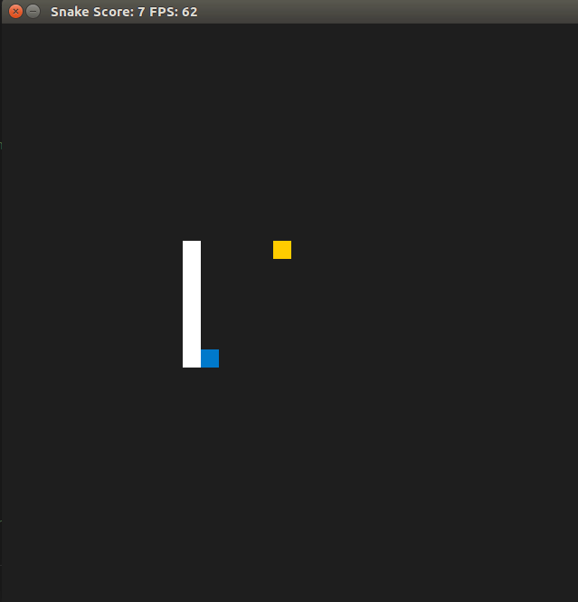

# CPPND: Capstone Snake Game Example

This is a starter repo for the Capstone project in the [Udacity C++ Nanodegree Program](https://www.udacity.com/course/c-plus-plus-nanodegree--nd213). The code for this repo was inspired by [this](https://codereview.stackexchange.com/questions/212296/snake-game-in-c-with-sdl) excellent StackOverflow post and set of responses.



The Capstone Project gives you a chance to integrate what you've learned throughout this program. This project will become an important part of your portfolio to share with current and future colleagues and employers.

In this project, you can build your own C++ application or extend this Snake game, following the principles you have learned throughout this Nanodegree Program. This project will demonstrate that you can independently create applications using a wide range of C++ features.

The project consists of the following files with the given folder structure:
```
|-- CMakeLists.txt
|-- README.md
|-- build
|   |-- CMakeCache.txt
|   |-- CMakeFiles
|   |-- Makefile
|   |-- SnakeGame
|   `-- cmake_install.cmake
|-- cmake
|   `-- FindSDL2_image.cmake
|-- snake_game.gif
`-- src
    |-- bonus_food.cpp
    |-- bonus_food.h
    |-- controller.cpp
    |-- controller.h
    |-- game.cpp
    |-- game.h
    |-- main.cpp
    |-- renderer.cpp
    |-- renderer.h
    |-- snake.cpp
    `-- snake.h
```
Here, bonus_food.cpp and bonus_food.h are newly created whithin this project compared to the [Udacity Project](https://github.com/udacity/CppND-Capstone-Snake-Game).

- main
In main all the necessary objects (Renderer, Game, Controller) are instantiated and the game started. 
- Game
Game is the centrall object in this project. It implements the game loop and administrates the state of the game.
- Controller
The controller handles the user input and interacts with the SDL library.
- Renderer
The rendrer takes the objects of the game and displays it using the SDL library.
- Snake
The snake keeps track of the size and the individual elements of the snake body.
- BonusFood 
BonusFood is a new class that is spawned after 10 food pieces have been eaten. It is visible for 5 seconds and disappears if not eaten in time. If it is collected, there is a bonus based on how fast it was eaten.

## Completed Rubrics 
1. The project uses smart pointers instead of raw pointers.
food, bonus_eaten and bonus_valid are defined as ```unique_ptr```s in ```game.h``` (line 25 - 28) and used in ```game.cpp``` as well as forwarded to ```bonus_food.cpp``` and ```renderer.cpp```.
2. The project uses multithreading.
A new task is created whenever bonus food is set on the game (line 82 in ```game.cpp```).
3. A mutex or lock is used in the project.
Mutexes protect the smartpointers and the score (e.g. line 78 in ```game.cpp```).
4. The project uses Object Oriented Programming techniques.
Implemented all over the project (e.g. in ```bonus_food.h```)
5. Classes encapsulate behavior.
Implemented all over the project (e.g. in ```bonus_food.h```)
6. Classes use appropriate access specifiers for class members.
Implemented all over the project (e.g. in ```bonus_food.h```)
7. The project accepts user input and processes the input.
User input as arrow keys are processed in ```controller``` (line 19-37).

  

## Dependencies for Running Locally
* cmake >= 3.7
  * All OSes: [click here for installation instructions](https://cmake.org/install/)
* make >= 4.1 (Linux, Mac), 3.81 (Windows)
  * Linux: make is installed by default on most Linux distros
  * Mac: [install Xcode command line tools to get make](https://developer.apple.com/xcode/features/)
  * Windows: [Click here for installation instructions](http://gnuwin32.sourceforge.net/packages/make.htm)
* SDL2 >= 2.0
  * All installation instructions can be found [here](https://wiki.libsdl.org/Installation)
  * Note that for Linux, an `apt` or `apt-get` installation is preferred to building from source.
* gcc/g++ >= 5.4
  * Linux: gcc / g++ is installed by default on most Linux distros
  * Mac: same deal as make - [install Xcode command line tools](https://developer.apple.com/xcode/features/)
  * Windows: recommend using [MinGW](http://www.mingw.org/)

## Basic Build Instructions

1. Clone this repo.
2. Make a build directory in the top level directory: `mkdir build && cd build`
3. Compile: `cmake .. && make`
4. Run it: `./SnakeGame`.